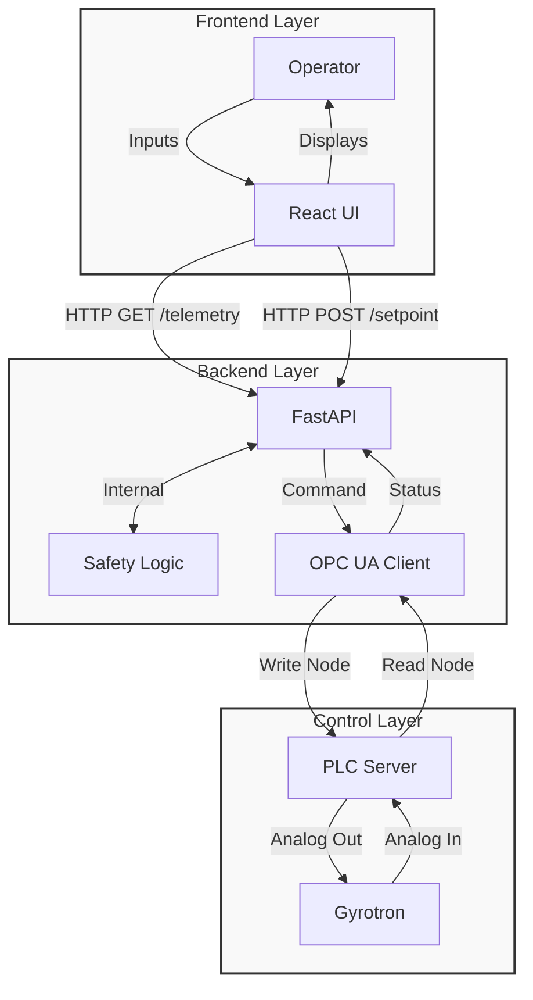

# Gyrotron Control System Technical Reference

## 1. System Architecture

The Gyrotron Control System is a full-stack web application designed to monitor and control high-power gyrotron devices. It follows a client-server architecture with a clear separation of concerns:

- **Frontend**: A React-based Single Page Application (SPA) providing a modern, responsive user interface for operators. It handles real-time data visualization, control inputs, and operational workflows.
- **Backend**: A FastAPI (Python) server acting as the bridge between the user interface and the hardware control layer. It exposes a RESTful API for telemetry and control.
- **Control Layer**: The backend acts as an **OPC UA Client**, communicating with the Programmable Logic Controller (PLC) which acts as an **OPC UA Server**. This connection is used to read sensors and actuation devices (ADAM-5000E modules). *Note: PLC integration is currently mocked.*



## 2. Backend API & Core Logic

The backend is built with **FastAPI** and served by **Uvicorn**.

### 2.1 API Endpoints (`app.api.endpoints`)

- **`GET /telemetry`**
    - **Purpose**: Provides real-time physics data for monitoring.
    - **Frequency**: Polled approx. every 1 second.
    - **Data Payload**:
        - `time`: Timestamp or sequence counter.
        - `ionV`, `ionI`: Ion Pump Voltage/Current.
        - `heatV`, `heatI`: Heater Voltage/Current.
        - `heLvl`: Liquid Helium Level (%).
        - `Thot`, `Tcold`: Temperature readings.
    - **Current Implementation**: Returns simulated sinusoidal data for development.

- **`GET /status`**
    - **Purpose**: Retrieves high-level system status and safety checks.
    - **Returns**: `{"status": "operational", "safety_ok": bool}`.

- **`POST /setpoint`**
    - **Purpose**: Sends control parameters to the hardware.
    - **Parameters**: `voltage` (float).
    - **Action**: Validates input and forwards to the OPC UA client.

### 2.2 Safety Module (`app.core.safety`)
This module contains critical safety logic independent of the API layer.
- `check_safety_interlocks()`: Verifies conditions like door locks, coolant flow, and vacuum levels.
- `emergency_stop()`: Triggers immediate shutdown procedures.

## 3. Frontend Application

The frontend is a **Vite + React 19** application using **TypeScript**. It utilizes **Tailwind CSS** for styling and **Recharts** for data visualization.

### 3.1 Key Components
- **Dashboard**: The main view displaying distinct gauge cards for critical metrics (Ion Pump, Heater, Cryo) and live area/line charts for voltage and current trends.
- **Startup Wizard**: A guided, step-by-step workflow for powering up the system. It enforces a strict sequence:
    1.  Pre-checks (Environment/Interlocks)
    2.  Ion Pump Power
    3.  Heater Warm-up
    4.  CPS (Cathode Power Supply) Activation
    5.  Setpoints Configuration (Pulse, Cathode, Anode)
    6.  APS (Anode Power Supply) Activation
    7.  Final Verification
- **Power Control**: Interface for adjusting voltage setpoints and toggling power supply rectifiers/converters.
- **Safety Monitor**: Real-time status list of interlocks (Environment, Supplies, Alarms, Cryo) with visual OK/Fault indicators.

### 3.2 State Management
- **Telemetry**: Managed via a custom hook `useTelemetry` that polls the backend and maintains a rolling buffer of the last 40 data points for charting.
- **Startup State**: Tracks the completion status of each step in the startup sequence to prevent out-of-order operations.

## 4. Safety Protocols

The application integrates safety checks at multiple levels:
1.  **Hardware Interlocks**: (Monitored via backend) Physical switches for doors, water flow, and vacuum status.
2.  **Software Limits**: The frontend restricts setpoint ranges (e.g., 0-10V sliders).
3.  **Operational Sequences**: The Startup Wizard prevents enabling high-voltage power supplies before low-voltage subsystems (Ion pump, Heater) are ready.
4.  **Emergency Stop**: A dedicated software trigger in the Safety tab to initiate a shutdown.

## 5. Setup and Development

### Prerequisites
- Python 3.8+
- Node.js 18+

### Standard Installation
1.  **Backend**:
    ```bash
    cd backend
    # Create configuration file from example
    cp .env.example .env
    # Install dependencies
    pip install -r requirements.txt
    # Run the server
    python -m uvicorn app.main:app --reload
    ```
2.  **Frontend**:
    ```bash
    cd frontend
    npm install
    npm run dev
    ```

### Configuration
- Backend runs on default port `8000`.
- Frontend proxies API requests to `http://localhost:8000`.
- External PLC connection usage requires configuring the OPC UA endpoint in environment variables (TBD).

## 6. Codebase Structure

### 6.1 Backend (`backend/app`)

| File | Purpose |
| :--- | :--- |
| `main.py` | **Application Entry Point**. Initializes the FastAPI app, configures CORS middleware, and mounts API routers. |
| `api/endpoints.py` | **API Routes**. Defines the HTTP endpoints for telemetry (`/telemetry`), status (`/status`), and control (`/setpoint`). Contains the route logic. |
| `core/safety.py` | **Safety Logic**. Contains critical safety checks (`check_safety_interlocks`) and emergency stop procedures independent of the API layer. |
| `core/auth.py` | **Authentication Service**. Implements LDAP/Active Directory authentication logic to verify user credentials. |
| `core/users.py` | **User Management**. Manages user roles and permissions (e.g., Operator vs. Admin). |
| `opcua/client.py` | **OPC UA Client**. Wrapper class for the `asyncua` library. Handles connection, disconnection, and reading/writing nodes to the PLC. |

### 6.2 Frontend (`frontend/src`)

| File | Purpose |
| :--- | :--- |
| `main.tsx` | **Frontend Entry Point**. Bootstraps the React application and mounts it to the DOM. |
| `App.tsx` | **Main Dashboard**. A monolithic component containing the core dashboard layout, state management (Telemetry hook, Polling), and sub-components (Dashboard, PowerTab, SafetyTab). |
| `components/Login.tsx` | **Authentication View**. Provides the login form for user session initiation via the backend API. |
| `components/AdminTab.tsx` | **Optimization/Admin**. Interface for administrative tasks, likely managing user roles or advanced system configuration. |
| `lib/utils.ts` | **Utilities**. Helper functions for CSS class merging (`cn`) and other shared logic. |
