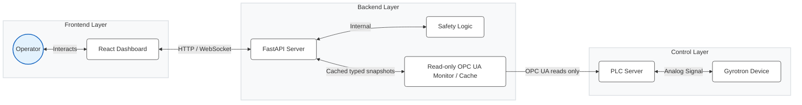

# Gyrotron Control System Technical Reference

## 1. System Architecture

The Gyrotron Control System is a full-stack HMI foundation for monitoring a high-power gyrotron installation. Phase 2 adds an explicitly read-only OPC UA monitoring boundary; it does not provide hardware control.

- **Frontend**: A React-based Single Page Application (SPA) providing a modern, responsive user interface for operators. It handles real-time data visualization, control inputs, and operational workflows.
- **Backend**: A FastAPI (Python) server that owns authentication, typed status, simulated telemetry, and the read-only OPC UA monitoring lifecycle.
- **PLC boundary**: An `asyncua` client can read configured telemetry nodes into an in-process typed cache. It exposes no write method. Simulation remains the default and never creates an OPC UA client.



## 2. Backend API & Core Logic

The backend is built with **FastAPI** and served by **Uvicorn**.

### 2.1 API Endpoints (`app.api.endpoints`)

- **`GET /api/telemetry`** (authenticated)
    - **Purpose**: Provides real-time physics data for monitoring.
    - **Frequency**: Polled approx. every 1 second.
    - **Data Payload**:
        - `timestamp`: UTC snapshot timestamp.
        - `source`: `simulation` or `opcua`.
        - `sequence`: Backend simulation sequence counter.
        - `ionV`, `ionI`, `heatV`, `heatI`, `heLvl`, `Thot`, `Tcold`: logical signals represented as `{value, unit, quality, source_timestamp}`.
        - Quality is one of `good`, `uncertain`, `bad`, or `unavailable`; bad/unavailable samples have no trusted numeric value.
    - In simulation, returns generated typed data. In `opcua_readonly`, returns the monitor's latest non-stale cached snapshot without doing PLC reads in the HTTP request. A missing/stale snapshot returns `503`.

- **`GET /api/status`** (authenticated)
    - **Purpose**: Returns the typed, backend-authoritative application status contract.
    - **Returns**: Mode, source, connection/data/overall states, CPS/APS state, interlocks, alarms and timestamp.
    - In simulation, PLC-dependent component and interlock states remain `unknown`.
    - In `opcua_readonly`, connection/data state comes from the monitor. CPS, APS, interlocks, alarms and overall machine state remain `unknown` because Phase 2 maps telemetry only.

- **`POST /api/setpoint`** (authenticated)
    - Reserved for the future command boundary.
    - Always returns `503 Service Unavailable`; no write is performed in either mode.

- **Authentication endpoints**
    - `POST /api/login` performs the LDAP check and creates an opaque server-side application session.
    - `GET /api/session` validates the current session and resolves the current role server-side.
    - `POST /api/logout` invalidates the session.
    - The session ID is held in an `HttpOnly`, `SameSite=Strict` cookie. `SESSION_COOKIE_SECURE` must be enabled behind HTTPS.
    - `/api/users` and all user mutations require the backend `admin` role. Telemetry and status require an authenticated user.

### 2.2 Safety Boundary (`app.core.safety`)
The safety module intentionally exposes no checks or commands. It is not used to assert machine safety. Interlocks are reported as `unknown`, and reset/emergency controls are visibly unavailable. Physical and PLC safety systems remain authoritative.

## 3. Frontend Application

The frontend is a **Vite + React 19** application using **TypeScript**. It utilizes **Tailwind CSS** for styling and **Recharts** for data visualization.

### 3.1 Key Components
- **Dashboard**: The main view displaying distinct gauge cards for critical metrics (Ion Pump, Heater, Cryo) and live area/line charts for voltage and current trends.
- **Startup Wizard**: Guidance only. Manual review marks are not verified machine state and do not affect backend CPS/APS/interlock status:
    1.  Pre-checks (Environment/Interlocks)
    2.  Ion Pump Power
    3.  Heater Warm-up
    4.  CPS (Cathode Power Supply) Activation
    5.  Setpoints Configuration (Pulse, Cathode, Anode)
    6.  APS (Anode Power Supply) Activation
    7.  Final Verification
- **Power Control**: Requested setpoints may be drafted locally, but Apply and all hardware controls are disabled in both modes. Backend status remains separate from requested values.
- **Safety Monitor**: Renders backend status. PLC-dependent interlocks are explicitly `UNKNOWN` until approved nodes and semantics are supplied.

### 3.2 State Management
- **Telemetry**: Managed via a custom hook `useTelemetry` that polls the backend and maintains a rolling buffer of the last 40 data points for charting.
- **Startup State**: Tracks manual guidance review only; it is not authoritative and is not persisted as machine state.

## 4. Safety Protocols

This application is not a safety-rated system and does not replace PLC or physical interlocks. No hardware commands, setpoint writes, reset commands, or emergency shutdown command are implemented. The disabled controls preserve future UI locations without implying that an action occurred.

## 5. Setup and Development

### Prerequisites
- Python 3.11+
- Node.js 18+

### Standard Installation
1.  **Backend**:
    ```bash
    cd backend
    # Create configuration file from example
    cp .env.example .env
    # Install dependencies
    pip install -r requirements.txt
    # Run the server
    python -m uvicorn app.main:app --reload
    ```
2.  **Frontend**:
    ```bash
    cd frontend
    npm install
    npm run dev
    ```

### Configuration
- Backend runs on default port `8000`.
- `backend/.env` is loaded and validated at startup. `APP_MODE=simulation` is the default; `APP_MODE=opcua_readonly` enables only the read monitor. Unsupported modes fail startup.
- Frontend and nginx preserve the `/api/...` prefix when proxying to FastAPI.
- Simulation does not create or contact an OPC UA client.

### Read-only OPC UA configuration

`opcua_readonly` requires `OPCUA_ENDPOINT_URL` and `OPCUA_NODE_MAP_PATH`. Timeouts, monitor interval, bounded reconnect delay and stale threshold are independently validated; see `backend/.env.example`.

The human-reviewable JSON node map contains exactly the seven logical telemetry signals. Each mapping defines:

```json
{
  "signal": "ionV",
  "node_id": "ns=2;s=Approved.Node.From.Controls.Engineering",
  "expected_type": "float",
  "unit": "V",
  "scale": 1.0,
  "offset": 0.0
}
```

The bundled `backend/config/opcua_nodes.example.json` is marked `purpose=template` and uses test-only identifiers. The application rejects it in `opcua_readonly`. Copy it to an untracked/local configuration file, replace every mapping with approved production data, review it, and set `purpose=production`. Placeholder, missing, duplicate or incomplete mappings are rejected.

For secure OPC UA, configure an explicit supported `OPCUA_SECURITY_POLICY`, `OPCUA_SECURITY_MODE`, client certificate and private key; an optional pinned server certificate is supported. Optional username/password authentication must be configured as a pair. Security setup failures abort the connection and never downgrade to insecure OPC UA. Do not commit credentials, certificates or private keys.

### Connection and quality semantics

- Connection state: `connecting`, `connected`, `disconnected`, or `error` (`simulated` in simulation).
- Data state: `live`, `degraded`, `stale`, or `unavailable`.
- Per-signal quality: `good`, `uncertain`, `bad`, or `unavailable`.
- Any partial bad/uncertain result is visibly degraded. Connection loss immediately makes cached data stale and later unavailable; it is never presented as nominal.
- Reconnect attempts are monitor-owned and use bounded exponential backoff. Frontend HTTP polling never drives OPC UA connection attempts.

### Local simulator tests

The backend integration suite starts an `asyncua` server bound only to `127.0.0.1`, creates test-only nodes, verifies typed reads and timestamps, drops the local transport, and verifies reconnect/recovery. It never uses a production endpoint or real PLC.

### Production information still required

Controls/PLC engineering must supply and approve the production endpoint, node IDs, namespace indexes or URIs, PLC data types, engineering units/scaling, sampling requirements, security policy, certificates/trust requirements, and any authentication requirements. CPS/APS state, interlock, protection and alarm nodes/semantics are also unknown. Command and acknowledgement nodes are deliberately out of Phase 2 and must not be configured as telemetry.

### Tests

```bash
cd backend
pip install -r requirements-dev.txt
pytest
```

Frontend validation remains:

```bash
cd frontend
npm run lint
npm run build
```

## 6. Codebase Structure

### 6.1 Backend (`backend/app`)

| File | Purpose |
| :--- | :--- |
| `main.py` | **Application Entry Point**. Initializes FastAPI and owns monitor startup/shutdown through lifespan. |
| `api/endpoints.py` | **API Routes**. Defines the HTTP endpoints for telemetry (`/telemetry`), status (`/status`), and control (`/setpoint`). Contains the route logic. |
| `core/safety.py` | **Safety Boundary Marker**. Explicitly documents that no safety decision or command is implemented. |
| `core/auth.py` | **Authentication Service**. Implements LDAP/Active Directory authentication logic to verify user credentials. |
| `core/users.py` | **User Management**. Manages user roles and permissions (e.g., Operator vs. Admin). |
| `opcua/client.py` | **Read-only OPC UA Client**. Handles bounded connection, disconnection and typed reads only. |
| `opcua/node_map.py` | Validates logical signal-to-node mappings, expected types, units and optional scaling. |
| `opcua/monitor.py` | Owns reconnect behavior and the latest cached typed telemetry snapshot. |

### 6.2 Frontend (`frontend/src`)

| File | Purpose |
| :--- | :--- |
| `main.tsx` | **Frontend Entry Point**. Bootstraps the React application and mounts it to the DOM. |
| `App.tsx` | **Main Dashboard**. A monolithic component containing the core dashboard layout, state management (Telemetry hook, Polling), and sub-components (Dashboard, PowerTab, SafetyTab). |
| `components/Login.tsx` | **Authentication View**. Provides the login form for user session initiation via the backend API. |
| `components/AdminTab.tsx` | **Optimization/Admin**. Interface for administrative tasks, likely managing user roles or advanced system configuration. |
| `lib/utils.ts` | **Utilities**. Helper functions for CSS class merging (`cn`) and other shared logic. |
