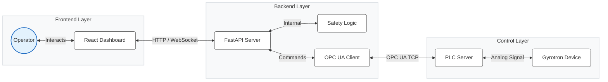

# Gyrotron Control System Technical Reference

## 1. System Architecture

The Gyrotron Control System is a full-stack web application designed to monitor and control high-power gyrotron devices. It follows a client-server architecture with a clear separation of concerns:

- **Frontend**: A React-based Single Page Application (SPA) providing a modern, responsive user interface for operators. It handles real-time data visualization, control inputs, and operational workflows.
- **Backend**: A FastAPI (Python) server acting as the bridge between the user interface and the hardware control layer. It exposes a RESTful API for telemetry and control.
- **Control Layer**: The intended backend boundary is an **OPC UA Client** communicating with the PLC. **Phase 1 does not implement or connect this boundary.** The application runs only in an explicit backend-owned simulation mode.



## 2. Backend API & Core Logic

The backend is built with **FastAPI** and served by **Uvicorn**.

### 2.1 API Endpoints (`app.api.endpoints`)

- **`GET /api/telemetry`** (authenticated)
    - **Purpose**: Provides real-time physics data for monitoring.
    - **Frequency**: Polled approx. every 1 second.
    - **Data Payload**:
        - `timestamp`: UTC source timestamp.
        - `source`: Explicitly `simulation` in Phase 1.
        - `sequence`: Backend simulation sequence counter.
        - `ionV`, `ionI`: Ion Pump Voltage/Current.
        - `heatV`, `heatI`: Heater Voltage/Current.
        - `heLvl`: Liquid Helium Level (%).
        - `Thot`, `Tcold`: Temperature readings.
    - **Current Implementation**: Returns simulated sinusoidal data for development.

- **`GET /api/status`** (authenticated)
    - **Purpose**: Returns the typed, backend-authoritative application status contract.
    - **Returns**: Mode, source, connection/data/overall states, CPS/APS state, interlocks, alarms and timestamp.
    - In simulation, PLC-dependent component and interlock states remain `unknown`; the backend never reports PLC connectivity.

- **`POST /api/setpoint`** (authenticated)
    - Reserved for the future command boundary.
    - Always returns `503 Service Unavailable` in Phase 1; no fake write is performed.

- **Authentication endpoints**
    - `POST /api/login` performs the LDAP check and creates an opaque server-side application session.
    - `GET /api/session` validates the current session and resolves the current role server-side.
    - `POST /api/logout` invalidates the session.
    - The session ID is held in an `HttpOnly`, `SameSite=Strict` cookie. `SESSION_COOKIE_SECURE` must be enabled behind HTTPS.
    - `/api/users` and all user mutations require the backend `admin` role. Telemetry and status require an authenticated user.

### 2.2 Safety Module (`app.core.safety`)
The existing safety module remains a placeholder. It is not used to assert machine safety. Interlocks are reported as `unknown`, and reset/emergency controls are visibly unavailable in simulation. Physical and PLC safety systems remain authoritative.

## 3. Frontend Application

The frontend is a **Vite + React 19** application using **TypeScript**. It utilizes **Tailwind CSS** for styling and **Recharts** for data visualization.

### 3.1 Key Components
- **Dashboard**: The main view displaying distinct gauge cards for critical metrics (Ion Pump, Heater, Cryo) and live area/line charts for voltage and current trends.
- **Startup Wizard**: Simulation guidance only. Manual review marks are not verified machine state and do not affect backend CPS/APS/interlock status:
    1.  Pre-checks (Environment/Interlocks)
    2.  Ion Pump Power
    3.  Heater Warm-up
    4.  CPS (Cathode Power Supply) Activation
    5.  Setpoints Configuration (Pulse, Cathode, Anode)
    6.  APS (Anode Power Supply) Activation
    7.  Final Verification
- **Power Control**: Requested setpoints may be drafted locally, but Apply and all hardware controls are disabled in simulation. Backend status remains separate from requested values.
- **Safety Monitor**: Renders backend status. PLC-dependent interlocks are explicitly `UNKNOWN` during Phase 1.

### 3.2 State Management
- **Telemetry**: Managed via a custom hook `useTelemetry` that polls the backend and maintains a rolling buffer of the last 40 data points for charting.
- **Startup State**: Tracks manual guidance review only; it is not authoritative and is not persisted as machine state.

## 4. Safety Protocols

Phase 1 is not a safety-rated system and does not replace PLC or physical interlocks. No hardware commands, reset commands, or emergency shutdown command are implemented. The disabled controls preserve the future UI locations without implying that an action occurred.

## 5. Setup and Development

### Prerequisites
- Python 3.8+
- Node.js 18+

### Standard Installation
1.  **Backend**:
    ```bash
    cd backend
    # Create configuration file from example
    cp .env.example .env
    # Install dependencies
    pip install -r requirements.txt
    # Run the server
    python -m uvicorn app.main:app --reload
    ```
2.  **Frontend**:
    ```bash
    cd frontend
    npm install
    npm run dev
    ```

### Configuration
- Backend runs on default port `8000`.
- `backend/.env` is loaded and validated at startup. `APP_MODE=simulation` is currently the only accepted mode; an unsupported value fails startup rather than falling back.
- Frontend and nginx preserve the `/api/...` prefix when proxying to FastAPI.
- No OPC UA endpoint is configured or contacted in Phase 1.

### Tests

```bash
cd backend
pip install -r requirements-dev.txt
pytest
```

Frontend validation remains:

```bash
cd frontend
npm run lint
npm run build
```

## 6. Codebase Structure

### 6.1 Backend (`backend/app`)

| File | Purpose |
| :--- | :--- |
| `main.py` | **Application Entry Point**. Initializes the FastAPI app, configures CORS middleware, and mounts API routers. |
| `api/endpoints.py` | **API Routes**. Defines the HTTP endpoints for telemetry (`/telemetry`), status (`/status`), and control (`/setpoint`). Contains the route logic. |
| `core/safety.py` | **Safety Logic**. Contains critical safety checks (`check_safety_interlocks`) and emergency stop procedures independent of the API layer. |
| `core/auth.py` | **Authentication Service**. Implements LDAP/Active Directory authentication logic to verify user credentials. |
| `core/users.py` | **User Management**. Manages user roles and permissions (e.g., Operator vs. Admin). |
| `opcua/client.py` | **OPC UA Client**. Wrapper class for the `asyncua` library. Handles connection, disconnection, and reading/writing nodes to the PLC. |

### 6.2 Frontend (`frontend/src`)

| File | Purpose |
| :--- | :--- |
| `main.tsx` | **Frontend Entry Point**. Bootstraps the React application and mounts it to the DOM. |
| `App.tsx` | **Main Dashboard**. A monolithic component containing the core dashboard layout, state management (Telemetry hook, Polling), and sub-components (Dashboard, PowerTab, SafetyTab). |
| `components/Login.tsx` | **Authentication View**. Provides the login form for user session initiation via the backend API. |
| `components/AdminTab.tsx` | **Optimization/Admin**. Interface for administrative tasks, likely managing user roles or advanced system configuration. |
| `lib/utils.ts` | **Utilities**. Helper functions for CSS class merging (`cn`) and other shared logic. |
