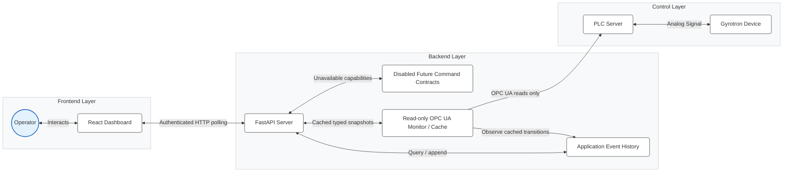

# Gyrotron Control System Technical Reference

## 1. System Architecture

The Gyrotron Control System is a full-stack HMI foundation for monitoring a high-power gyrotron installation. Phase 4 adds persistent application event history and an explicit, disabled-by-default future command contract to the Phase 3 read-only OPC UA monitoring boundary. It does not provide hardware control.

- **Frontend**: A React-based Single Page Application (SPA) providing a modern, responsive user interface for operators. It handles real-time data visualization, control inputs, and operational workflows.
- **Backend**: A FastAPI (Python) server that owns authentication, typed status, simulated telemetry, persistent application event history, future command capability reporting, and the read-only OPC UA monitoring lifecycle.
- **PLC boundary**: One `asyncua` client reads configured telemetry and state nodes into one in-process typed snapshot/cache. It exposes no write method. Simulation remains the default and never creates an OPC UA client.

The authoritative path is:

```text
PLC OPC UA server
→ read-only typed telemetry/state mappings
→ one reconnecting monitor/cache
→ authoritative system snapshot
→ transition detector and append-oriented application event history
→ authenticated FastAPI monitoring/event/capability APIs
→ React HMI
```



## 2. Backend API & Core Logic

The backend is built with **FastAPI** and served by **Uvicorn**.

### 2.1 API Endpoints (`app.api.endpoints`)

- **`GET /api/telemetry`** (authenticated)
    - **Purpose**: Provides real-time physics data for monitoring.
    - **Frequency**: Polled approx. every 1 second.
    - **Data Payload**:
        - `timestamp`: UTC snapshot timestamp.
        - `source`: `simulation` or `opcua`.
        - `sequence`: Backend simulation sequence counter.
        - `ionV`, `ionI`, `heatV`, `heatI`, `heLvl`, `Thot`, `Tcold`: logical signals represented as `{value, unit, quality, source_timestamp}`.
        - Quality is one of `good`, `uncertain`, `bad`, or `unavailable`; bad/unavailable samples have no trusted numeric value.
    - In simulation, returns generated typed data. In `opcua_readonly`, returns the monitor's latest non-stale cached snapshot without doing PLC reads in the HTTP request. A missing/stale snapshot returns `503`.

- **`GET /api/status`** (authenticated)
    - **Purpose**: Returns the typed, backend-authoritative application status contract.
    - **Returns**: Mode, source, connection/data/overall states, CPS/APS state, interlocks, alarms and timestamp.
    - In simulation, PLC-dependent component and interlock states remain `unknown`.
    - In `opcua_readonly`, connection/data state, CPS, APS, interlocks, alarms, mapping coverage, and conservative overall state come from the same monitor snapshot. Unmapped, untrusted, stale, or unavailable state remains `unknown`.

- **`POST /api/setpoint`** (authenticated)
    - Reserved for the future command boundary.
    - Records a rejected command attempt when history is available and always returns `503 Service Unavailable`; no write is performed in either mode.

- **`GET /api/events`** (authenticated)
    - Returns a bounded, newest-first page from persistent application event history.
    - Supports `before_id` pagination and category, severity, type, and actor filters. There is no event update or delete API.

- **`GET /api/command-capabilities`** (authenticated)
    - Returns future logical command contracts and their unresolved commissioning blockers.
    - Every capability is unavailable. The endpoint is descriptive only and cannot execute, enable, acknowledge, or simulate a command.

- **Authentication endpoints**
    - `POST /api/login` performs the LDAP check and creates an opaque server-side application session.
    - `GET /api/session` validates the current session and resolves the current role server-side.
    - `POST /api/logout` invalidates the session.
    - The session ID is held in an `HttpOnly`, `SameSite=Strict` cookie. `SESSION_COOKIE_SECURE` must be enabled behind HTTPS.
    - `/api/users` and all user mutations require the backend `admin` role. Telemetry and status require an authenticated user.

### 2.2 Safety Boundary (`app.core.safety`)
The safety module intentionally exposes no checks or commands. It is not used to assert machine safety. Mapped interlocks are displayed as PLC observations with quality/freshness; every unproven value is `unknown`. Reset/emergency controls remain visibly unavailable. Physical and PLC safety systems remain authoritative.

## 3. Frontend Application

The frontend is a **Vite + React 19** application using **TypeScript**. It utilizes **Tailwind CSS** for styling and **Recharts** for data visualization.

### 3.1 Key Components
- **Dashboard**: The main view displaying distinct gauge cards for critical metrics (Ion Pump, Heater, Cryo) and live area/line charts for voltage and current trends.
- **Startup Wizard**: Guidance only. Manual review marks are not verified machine state and do not affect backend CPS/APS/interlock status:
    1.  Pre-checks (Environment/Interlocks)
    2.  Ion Pump Power
    3.  Heater Warm-up
    4.  CPS (Cathode Power Supply) Activation
    5.  Setpoints Configuration (Pulse, Cathode, Anode)
    6.  APS (Anode Power Supply) Activation
    7.  Final Verification
- **Power Control**: Requested setpoints may be drafted locally, but Apply and all hardware controls are disabled in both modes. Backend status remains separate from requested values.
- **Safety Monitor**: Renders backend-authoritative interlock and alarm observations, including mapping, quality, freshness, and configured severity. It never renders unknown, stale, uncertain, or unavailable state as green/OK.
- **Alarm presentation**: Distinguishes confirmed active alarms, confirmed no active alarms, incomplete coverage, and unavailable monitoring. `No active alarms` appears only when every supported alarm signal is mapped, fresh, good-quality, and explicitly inactive.
- **Event Log**: Reads real backend application events with bounded pagination and category/severity filters. It is not a PLC, safety-rated, certified, or cryptographically tamper-proof historian.
- **Future command controls**: Disabled control tooltips use backend capability blockers. Slider limits remain presentation-only draft limits and are not approved machine constraints.

### 3.2 State Management
- **Telemetry**: Managed via a custom hook `useTelemetry` that polls the backend and maintains a rolling buffer of the last 40 data points for charting.
- **Startup State**: Tracks manual guidance review only; it is not authoritative and is not persisted as machine state.

## 4. Safety Protocols

This application is not a safety-rated system and does not replace PLC or physical interlocks. No hardware commands, setpoint writes, reset commands, or emergency shutdown command are implemented. The disabled controls preserve future UI locations without implying that an action occurred.

## 5. Setup and Development

### Prerequisites
- Python 3.11+
- Node.js 18+

### Standard Installation
1.  **Backend**:
    ```bash
    cd backend
    # Create configuration file from example
    cp .env.example .env
    # Install dependencies
    pip install -r requirements.txt
    # Run the server
    python -m uvicorn app.main:app --reload
    ```
2.  **Frontend**:
    ```bash
    cd frontend
    npm install
    npm run dev
    ```

### Configuration
- Backend runs on default port `8000`.
- `backend/.env` is loaded and validated at startup. `APP_MODE=simulation` is the default; `APP_MODE=opcua_readonly` enables only the read monitor. Unsupported modes fail startup.
- `EVENT_DB_PATH` selects the application event-history database; relative paths are anchored to `backend/`.
- Frontend and nginx preserve the `/api/...` prefix when proxying to FastAPI.
- Simulation does not create or contact an OPC UA client.

### Read-only OPC UA configuration

`opcua_readonly` requires `OPCUA_ENDPOINT_URL` and `OPCUA_NODE_MAP_PATH`. Timeouts, monitor interval, bounded reconnect delay and stale threshold are independently validated; see `backend/.env.example`.

The human-reviewable JSON node map contains exactly the seven logical telemetry signals and an optional `state_signals` array. Telemetry mappings define:

```json
{
  "signal": "ionV",
  "node_id": "ns=2;s=Approved.Node.From.Controls.Engineering",
  "expected_type": "float",
  "unit": "V",
  "scale": 1.0,
  "offset": 0.0
}
```

State mappings define the logical signal, NodeId, expected PLC type, and an explicit raw-to-application interpretation. Optional display labels/groups and alarm severity are presentation metadata:

```json
{
  "signal": "interlock.poor_vacuum",
  "node_id": "ns=2;s=Approved.Node.From.Controls.Engineering",
  "expected_type": "boolean",
  "interpretation": {"true": "fault", "false": "ok"},
  "display_label": "Poor vacuum",
  "group": "Environment"
}
```

Boolean mappings must contain both `true` and `false`; there is no global polarity assumption. Integer mappings use explicit canonical integer keys, for example `{"0":"off","1":"on","2":"fault"}`. Values outside that mapping become `UNKNOWN`. Supported application semantics are constrained by signal role: component power state uses `on/off/fault`, readiness/protection/interlocks use `ok/fault`, and alarms use `active/inactive`. Unsupported PLC types, invalid enum keys, invalid severity, duplicate logical names, and duplicate NodeIds are rejected.

The bundled `backend/config/opcua_nodes.example.json` is marked `purpose=template` and uses test-only identifiers. The application rejects it in `opcua_readonly`. Copy it to an untracked/local configuration file, replace every mapping with approved production data, review it, and set `purpose=production`. The seven telemetry mappings remain mandatory. Production state mapping may be partial during commissioning: every absent logical state is listed in coverage and exposed as `UNKNOWN`, never fabricated. Placeholder/test NodeIds and malformed mappings are rejected.

The Control HMI uses one typed equipment snapshot in simulation and `opcua_readonly`. Optional production mappings populate these established logical readbacks: `cmps.current` (A), `cfps.power` (W), `ipps.voltage` (V), `ipps.current` (A), `ahvps.voltage` (kV), `chvps.voltage` (kV), `pulse_generator.length` (ms), and `pulse_generator.period` (s). Equipment states and conditions use `cmps.state`, `interlock.cmps`, `cfps.state`, `cfps.feedback`, `interlock.cfps`, `ipps.state`, `interlock.ipps`, `alarm.arc_detector`, `ahvps.state`, `ahvps.protection`, `interlock.ahvps`, `chvps.state`, `chvps.protection`, `interlock.chvps`, `pulse_generator.state`, and `pulse_generator.feedback`. Omitted optional mappings remain explicitly not mapped/unavailable in the equipment contract and Diagnostics; they never fall back to simulation or infer state from a numeric reading. Exact NodeIds, PLC types, interpretations, scaling, and offsets remain commissioning inputs from controls engineering.

`backend/config/opcua_nodes.production.template.json` is a separate, deliberately non-executable commissioning workspace. Its `purpose=production-template`, nullable facts, candidate sources, confidence levels, and notes are rejected by the runtime `NodeMap` loader. Inspect its readiness with `python -m app.opcua.commissioning report config/opcua_nodes.production.template.json`; `validate` exits non-zero while blockers remain. The synchronized human-readable matrix is in `docs/opcua_production_commissioning.md`. Changing only the template purpose cannot create a runnable map: an approved runtime file must be authored separately and independently pass the strict production `NodeMap` and security validation.

The offline/localhost commissioning harness is documented in [`docs/opcua_commissioning_runbook.md`](docs/opcua_commissioning_runbook.md). It provides a loopback-only 15-signal simulator, deterministic failure fixtures, canonical discovered-node reconciliation, guarded draft generation, and read-only backend/HMI diagnostics. It does not browse a network or create an executable production map.

Non-local OPC UA requires `SignAndEncrypt`, an explicitly configured supported `OPCUA_SECURITY_POLICY`, a client certificate/private key, and an explicitly pinned trusted server certificate. Optional username/password authentication must be configured as a pair and is rejected on an insecure channel. `OPCUA_ALLOW_INSECURE_LOCALHOST=true` permits `None` security only for `127.0.0.1`, `::1`, or `localhost` development/tests. Security setup failures abort the connection and reconnect with the same approved profile; there is no insecure fallback. Do not commit credentials, certificates or private keys.

### Connection and quality semantics

- Connection state: `connecting`, `connected`, `disconnected`, or `error` (`simulated` in simulation).
- Data state: `live`, `degraded`, `stale`, or `unavailable`.
- Per-signal quality: `good`, `uncertain`, `bad`, or `unavailable`.
- State observations retain the raw PLC boolean/integer, interpreted application state, quality, source timestamp, monitor observation time, source, and per-signal data state.
- `source_timestamp` is PLC provenance. `observed_at` is the successful backend observation/read time and drives communication freshness; an unchanged boolean is not stale merely because its source timestamp is old.
- Only fresh, good-quality values with an explicit interpretation can produce trusted `ON`, `OFF`, `OK`, `FAULT`, `ACTIVE`, or `INACTIVE`. Uncertain quality remains visible but is not trusted as a positive state. Bad/unavailable quality becomes `UNKNOWN`; communication failure is neither a confirmed fault nor OK.
- One bad node degrades only that signal; unrelated good observations remain usable. Connection loss immediately makes cached state stale and removes trusted positive indications, then makes it unavailable after the configured threshold.
- Reconnect attempts are monitor-owned and use bounded exponential backoff. Frontend HTTP polling never drives OPC UA connection attempts.

### Persistent application event history

The backend owns one append-oriented SQLite event store, configured by `EVENT_DB_PATH` (default `backend/data/events.sqlite3`). Runtime database, WAL, and shared-memory files are ignored by git. Initialization and write failures are logged clearly; monitoring and authentication continue, while event queries return `503` instead of inventing history.

Events distinguish the backend `recorded_at` UTC timestamp from an optional PLC `source_timestamp`. Categories cover application lifecycle, monitoring, machine state, interlocks, alarms, security, operator activity, and rejected/future command activity. Login outcomes, logout, administrator user changes, application lifecycle, monitoring health, trustworthy machine-state transitions, interlock transitions, and alarm activation/clear transitions are recorded without credentials, session identifiers, or authentication tokens.

On observer startup, one baseline event is written rather than synthesizing a transition for every current state. Repeated identical snapshots are deduplicated. Communication loss is recorded once and cannot fabricate a physical transition from values that are stale, unmapped, poor-quality, or uninterpretable. If a trustworthy value differs after a monitoring gap, the event records the newly observed value with `observed_after_gap=true` and `change_time_known=false`; it does not claim when the physical change occurred.

### Mapping coverage and overall state

The Phase 3 logical contract contains CPS/APS overall, ready, rectifier, converter, and protection signals; environment/supply/cryo interlocks; and four alarm concepts. `/api/status.coverage` reports total, mapped, trustworthy, complete, and missing logical names.

A confirmed fresh, good-quality mapped fault or active alarm may produce `overall_state=fault`, even if another unrelated signal is missing. `overall_state=nominal` requires the entire supported state contract to be mapped and trustworthy with no interpreted fault/active value. Partial or degraded coverage therefore produces `unknown`. This is an HMI monitoring summary, never a “safe to operate” assertion.

### Future command contract boundary

Phase 4 defines logical contracts for setpoint application, CPS/APS rectifier and converter control, protection/interlock reset, and emergency shutdown. These are reviewable schemas and capability diagnostics only: there is no command executor, OPC UA writer, queue, retry worker, or enable flag. Every capability remains fail-closed and unavailable while any production prerequisite is unresolved.

A future command transaction would need to follow this boundary: request → server-side authentication and authorization → approved command contract → fresh authoritative machine-state/precondition check → durable intent record (fail closed if mandatory audit is unavailable) → exact approved PLC write → explicit PLC readback/acknowledgement → durable result record → operator result. An HTTP `200` following a write request would not, by itself, prove command success.

Production commissioning must separately approve exact write and readback/acknowledgement NodeIds and PLC types; ranges, engineering units, scaling, tolerance, settling and polarity; pulse/hold semantics for resets; role and confirmation policy; state/interlock/alarm preconditions; timing, timeout, failure and network-loss semantics; retry and idempotency rules; and mandatory audit behavior. Emergency shutdown semantics and whether software initiation is appropriate require explicit controls and safety engineering approval. Nothing in the template supplies or infers these facts.

### Local simulator tests

The backend integration suite starts an `asyncua` server bound only to `127.0.0.1`, creates test-only telemetry/component/interlock/alarm nodes, verifies raw and interpreted values, polarity, partial failures, timestamps, fault transitions, stale/unavailable state, and reconnect/recovery. It never uses a production endpoint or real PLC.

### Production information still required

Controls/PLC engineering must supply and approve the production endpoint, namespace indexes/URIs, PLC data types, engineering units/scaling, sampling requirements, security policy, certificates/trust requirements, and authentication requirements. No production state or command mapping is known in this repository. Required monitoring information includes CPS/APS state, ready, rectifier, converter and protection NodeIds/types/semantics; all environment, supply and cryo interlock NodeIds and polarity; all alarm NodeIds, polarity, severity and any latching semantics; and any integer enum meanings. Future command/reset/emergency/write/readback/acknowledgement nodes belong only in a separately approved production command contract and must not be added to the Phase 3 read-only map.

### Tests

```bash
cd backend
pip install -r requirements-dev.txt
pytest
```

Frontend validation remains:

```bash
cd frontend
npm run lint
npm run build
```

## 6. Codebase Structure

### 6.1 Backend (`backend/app`)

| File | Purpose |
| :--- | :--- |
| `main.py` | **Application Entry Point**. Initializes FastAPI and owns event store, observer, and monitor startup/shutdown through lifespan. |
| `api/endpoints.py` | **API Routes**. Defines monitoring, event history, unavailable command-capability, authentication, and user administration endpoints. |
| `core/safety.py` | **Safety Boundary Marker**. Explicitly documents that no safety decision or command is implemented. |
| `core/auth.py` | **Authentication Service**. Implements LDAP/Active Directory authentication logic to verify user credentials. |
| `core/users.py` | **User Management**. Manages user roles and permissions (e.g., Operator vs. Admin). |
| `opcua/client.py` | **Read-only OPC UA Client**. Handles bounded connection, disconnection and typed reads only. |
| `opcua/node_map.py` | Validates telemetry/state mappings, expected types, explicit interpretation, presentation metadata, and production protections. |
| `opcua/monitor.py` | Owns reconnect behavior and the single cached typed telemetry/machine-state snapshot. |
| `events/` | Append-oriented SQLite event storage and deduplicating trusted-state transition detection. |
| `commands/` | Future logical command schemas and fail-closed capability blocker evaluation; contains no executor. |

### 6.2 Frontend (`frontend/src`)

| File | Purpose |
| :--- | :--- |
| `main.tsx` | **Frontend Entry Point**. Bootstraps the React application and mounts it to the DOM. |
| `App.tsx` | **Main Dashboard**. A monolithic component containing the core dashboard layout, state management (Telemetry hook, Polling), and sub-components (Dashboard, PowerTab, SafetyTab). |
| `components/Login.tsx` | **Authentication View**. Provides the login form for user session initiation via the backend API. |
| `components/AdminTab.tsx` | **Optimization/Admin**. Interface for administrative tasks, likely managing user roles or advanced system configuration. |
| `lib/utils.ts` | **Utilities**. Helper functions for CSS class merging (`cn`) and other shared logic. |
